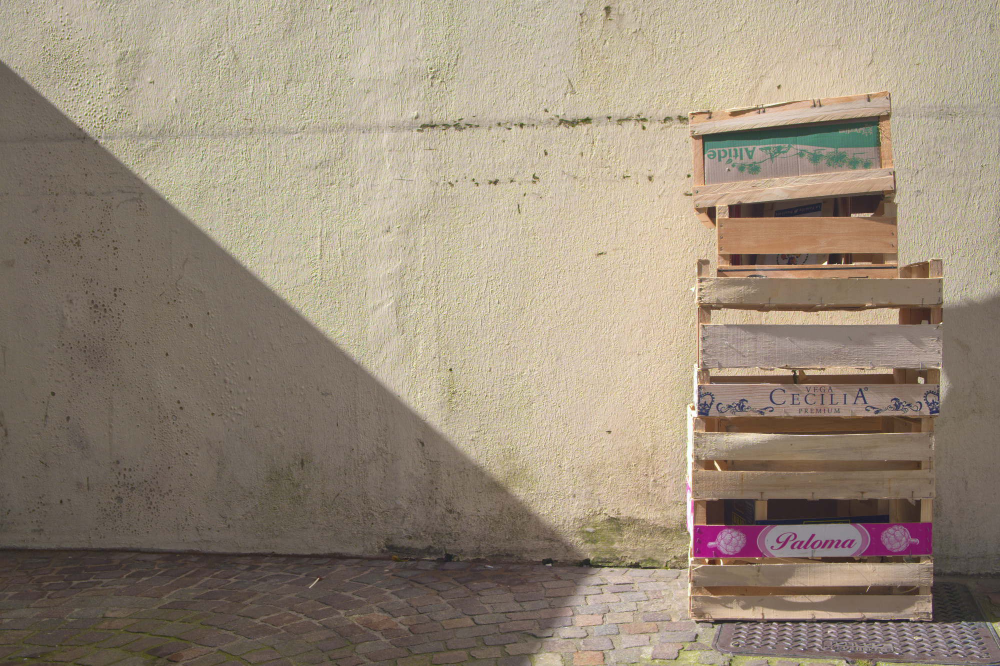
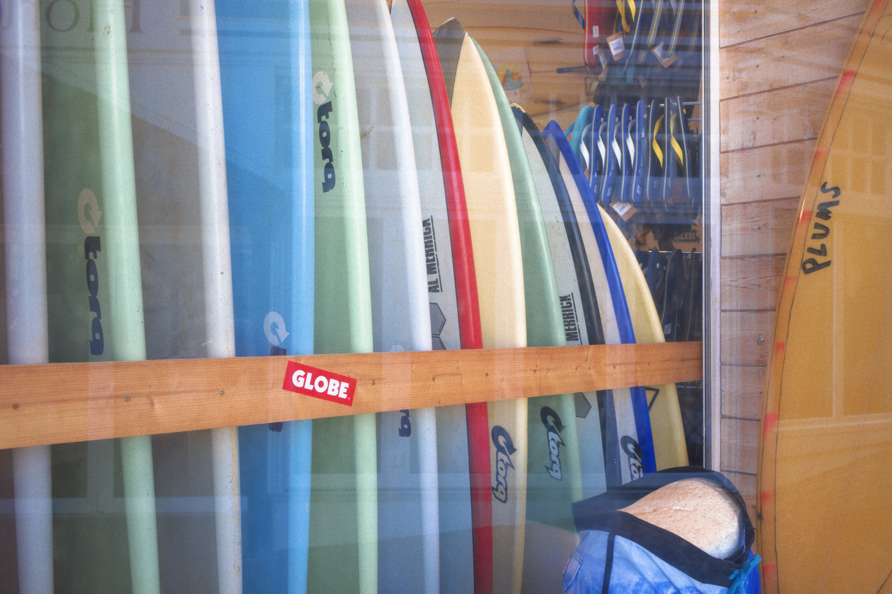

<!-- =========================
     COUVERTURE
========================= -->

<section class="cover page">

<h1>Odyssée</h1>

<h2>Le Monolithe</h2>

Une méditation photographique sur la matière,
la mémoire et les traces humaines.

<a class="enter" href="#" onclick="next(); return false;">
    Entrer →
</a>

</section>

<!-- =========================
     PHOTOGRAPHIE 01
========================= -->

<section class="photo-page page">

Monolithe I

</section>

<!-- =========================
     PAGE TEXTE
========================= -->

::: {.text-page .page}

::: {.text-content}

## Le Monolithe

Il demeure là, silencieux, comme une présence dont le temps aurait effacé l'origine.

La matière ne raconte rien. Elle conserve. Les traces, les fissures et les surfaces portent une mémoire qui ne demande pas à être déchiffrée.

Devant ces formes immobiles, le regard se déplace lentement. Ce qui semblait être une pierre devient architecture, puis paysage, puis fragment de mémoire.

:::

:::

<!-- =========================
     PHOTOGRAPHIE 02
========================= -->

<section class="photo-page page">

Monolithe II

</section>

<!-- =========================
     PHOTOGRAPHIE 03
========================= -->

<section class="photo-page page">

Monolithe III

</section>

<!-- =========================
     PHOTOGRAPHIE 04
========================= -->

<section class="photo-page page">

Monolithe IV

</section>

<!-- =========================
     FIN DU LIVRE
========================= -->

<!-- Compteur -->

<!-- Zones de navigation -->

